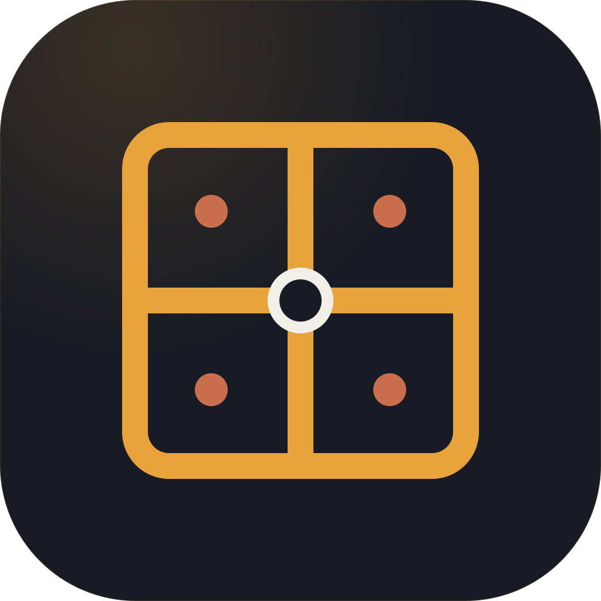
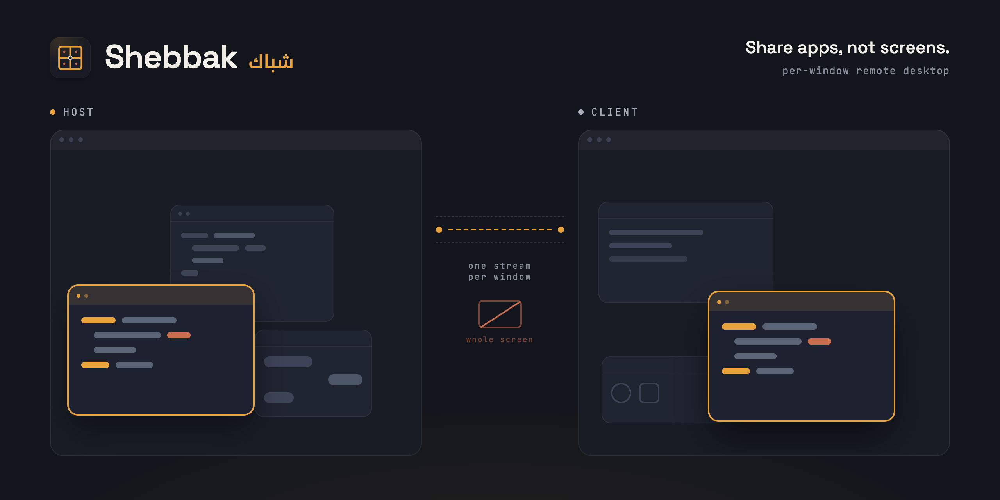

<p align="center">
  
</p>

<h1 align="center">Shebbak (شباك)</h1>

<p align="center"><b>Share apps, not screens.</b></p>



Sharing your whole screen never feels natural. The viewer gets one big rectangle with everything you have open, and remote-controlling it means living inside that rectangle.

Sharing each window is easier. Shebbak mirrors individual app windows from another machine, and every mirror is a real native window on your desk: move it, resize it, click it, type in it.

*Shebbak* (شباك) is Egyptian Arabic for window, from the same root as *shabaka* (شبكة), network. Windows over the network.

> **Status: early / experimental.** No auth or encryption hardening yet. Don't run it on networks you don't trust.

## Platform support

| Platform | Host | Client |
|---|---|---|
| macOS | ✅ | ✅ |
| Windows | ❌ | ❌ |
| Linux | ❌ | ❌ |

## Network support

| Network | Supported |
|---|---|
| LAN | ✅ |
| STUN | ❌ |
| TURN | ❌ |

## What it does

- **Share whole apps by picking them.** Every window of the shared app mirrors automatically, including ones it opens later.
- **Windows behave like windows.** Each mirror is a native window your window manager owns. Move them, resize them (the real window resizes too), close them (the app gets a real close, unsaved-changes sheets included).
- **Menus, sheets, and popups work.** ScreenCaptureKit composites child windows straight into the window's stream (macOS 14.2+), so dropdown menus, right-click context menus, and sheets appear in place, once, at full video quality.
- **Each mirrored app is a real app on the client.** Every shared app runs in its own native process with its own Dock tile: the host app's real name and icon (badged with the Shebbak mark), its own Cmd-Tab entry, its own menu-bar name, and windows that minimize into their own tile. Cmd-Q on a mirror quits just that app's mirrors and tells the host to stop streaming it.
- **Full input.** Keyboard (with modifiers), mouse, and focus routing. Typing lands in the right app even with several apps shared.
- **Minimize/restore, live resize, title sync** all mirror across.
- **Survives packet loss.** Video recovers in about a second via PLI-triggered keyframes.

## How it works

- One WebRTC peer connection per session. Regular windows stream as individual **H.264 video tracks**, added and removed at runtime via SDP renegotiation over the control data channel. Oversized control messages (a many-window session's SDP can pass 64 KiB) are chunked and reassembled, so sharing lots of windows keeps working.
- Transient windows (menus, tooltips, popups, sheets) ride the parent window's video stream via native child-window compositing: one rendering path, no separate overlay lifecycle to keep in sync. When an oversized sheet overflows the window, the stream letterboxes and a change-triggered `InputMapping` message keeps clicks accurate.
- The client splits into a coordinator and one helper process per shared app. The coordinator owns the network side and routes video; each helper is spawned from a stub `.app` bundle so macOS gives it a real Dock identity, and it draws that app's mirror windows. The host sends each app's name and icon when it announces the app. If a helper's last window closes it exits, and the coordinator respawns it when the app opens windows again.
- The host watches shared apps with a CGWindowList reconciler poked by per-app Accessibility observers, so window lifecycle changes propagate in ~100 ms instead of on a poll.
- Input goes back over the same data channel and is replayed on the host via Accessibility/CGEvent.

## Quick start

Requirements: a host and a client machine on the same LAN (see platform support), macOS 14+, Rust toolchain. The host machine needs **Screen Recording** and **Accessibility** permissions for your terminal.

```bash
# On the host, pick the apps to share when prompted:
cargo run --release -p srw-host

# On the client:
SRW_HOST=http://<host-ip>:9009/offer cargo run --release -p srw-client
```

Useful env vars:

| Var | Effect |
|---|---|
| `SRW_SHARE_PIDS=123,456` | Host: share these pids, skip the interactive picker |
| `SRW_INPUT=pid` | Host: experimental pid-targeted input (default is activate-then-post) |
| `RUST_LOG=debug` | Verbose logging on either side |

## Crate layout

| Crate | Role |
|---|---|
| `core` | Protocol, window tracking/classification, frame metadata |
| `transport` | WebRTC peer, H.264 codec, signalling |
| `capture` | ScreenCaptureKit + CGWindowList + Accessibility glue |
| `input` | Input replay (CGEvent/AX) |
| `host` | Host binary: session orchestration, encode pipelines, native child-window streaming |
| `client` | Viewer binaries: `srw-client` coordinator plus the per-app `srw-mirror-helper` that draws native mirror windows, decodes, and captures input |

## Roadmap

- **Now:** whole-app sharing on LAN with menus, input, and loss recovery (this repo).
- **Next:** real signalling, authentication, STUN/TURN so it works across networks, plus self-hosting docs.
- **Later:** codec work. Damage regions, 4:4:4 for crisp text, smarter encoder strategy for many windows.

## License

[AGPL-3.0](LICENSE). In short: use it, fork it, self-host it freely, but if you run a modified version as a service you must share your changes.
